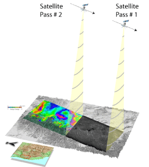
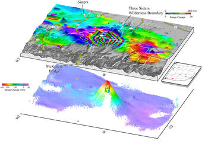
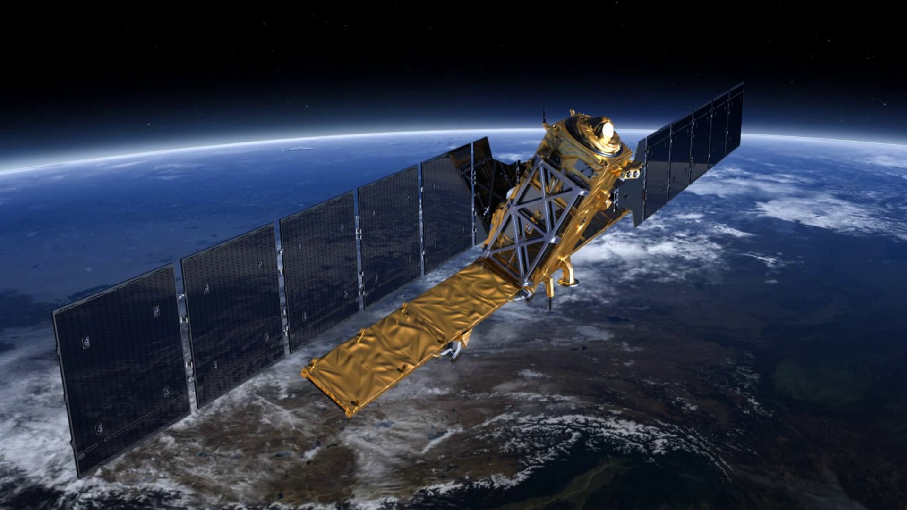

# InSAR technique details

InSAR (Interferometric Synthetic Aperture Radar) is a technique for mapping ground deformation using radar images of the Earth's surface that are collected from orbiting satellites. Unlike visible or infrared light, radar waves penetrate most weather clouds and are equally effective in darkness. So with InSAR it is possible to track ground deformation even in bad weather and at night – two big advantages during a volcanic crisis.

Two radar images of the same area that were collected at different times from similar vantage points in space can be compared against each other. Any movement of the ground surface toward or away from the satellite can be measured and portrayed as a "picture" – not of the surface itself but of how much the surface moved (deformed) during the time between images.

To create this radar deformation"picture" a pulse of radar energy is emitted from a satellite, scattered by the Earth's surface, and recorded back at the satellite with two types of information: amplitude and phase. The amplitude is the strength of the return signal, influenced by the physical properties of the surface. The round trip distance from the satellite to the ground and back again is measured in units of the radar wavelength, and changes in that distance between the time two radar images were collected show up as a phase difference. Combining these two images is called "interfering" because combining two waves causes them to either reinforce or cancel one another.

InSAR greatly extends the ability of scientists to monitor volcanoes because, unlike other techniques that rely on measurements at a few points, InSAR produces a map of ground deformation that covers a very large spatial area with centimeter-scale accuracy. This technique is especially useful at remote, difficult-to-access volcanoes and at locations where hazardous conditions prevent or limit ground-based volcano monitoring.

Currently the most widely used InSAR satellite is Sentinel-1, which is operated by ESA and is open to everyone. In this program, we will mostly use Sentinel-1 data for processing.

